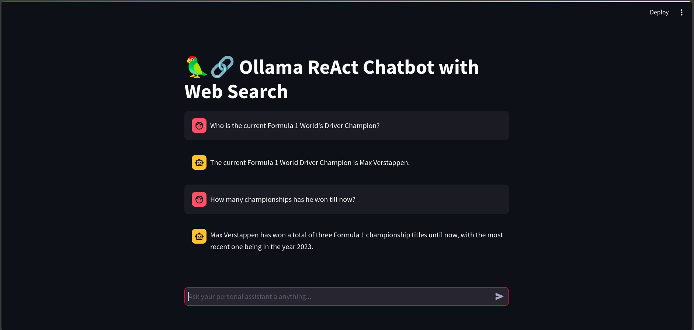

# OllamaChat-Tavily - A Streamlit Chatbot

## Description

OllamaChat-Tavily is a chatbot application built with Python, using the Ollama and LangChain libraries. It allows users to interact with different chatbot models, which can be selected from a dropdown menu. It uses the [Tavily API](https://tavily.com/) to conduct web searches and provide answers to questions. It uses the ReAct agent schema for inference

> [!Caution]
> These models tend to hallucinate :D
> Any improvements or fixes are welcome

## Installation

Before running the application, you need to install the necessary Python libraries. You can do this by running the following command:

1. Download Ollama from [here](https://github.com/ollama/ollama) and download the models you want using the instructions in the README file.

2. Install the required Python libraries using the following command:

```bash
pip install -r requirements.txt
```

## Usage

Add your Tavily API key in a `.env` file as shown in `.env.sample`

> [!TIP]
> Tavily at times can be quite slow as well using the `TavilySearchResults` API. Can use the `TavilyAnswer` API as well for slightly faster results in my experience. Can change the max search results field in `TavilyAnswer()` as well to do more searches or less searches.

To run the application, use the following command:

```bash
streamlit run ollama-tavily.py
```

or

```bash
python -m streamlit run ollama-tavily.py
```

> [!IMPORTANT]
> Feel free to change the default prompt being used.

## Demo


